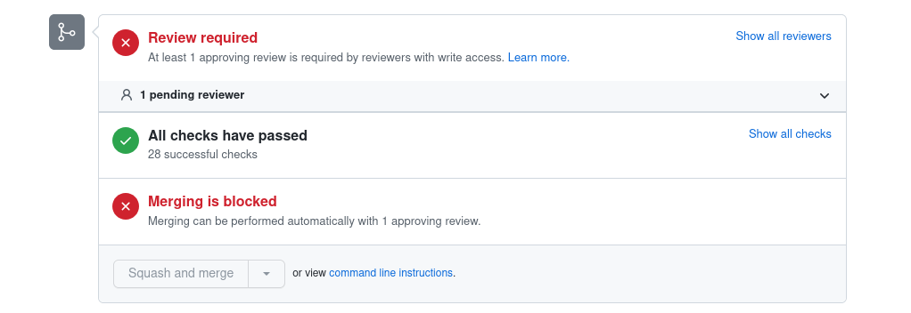
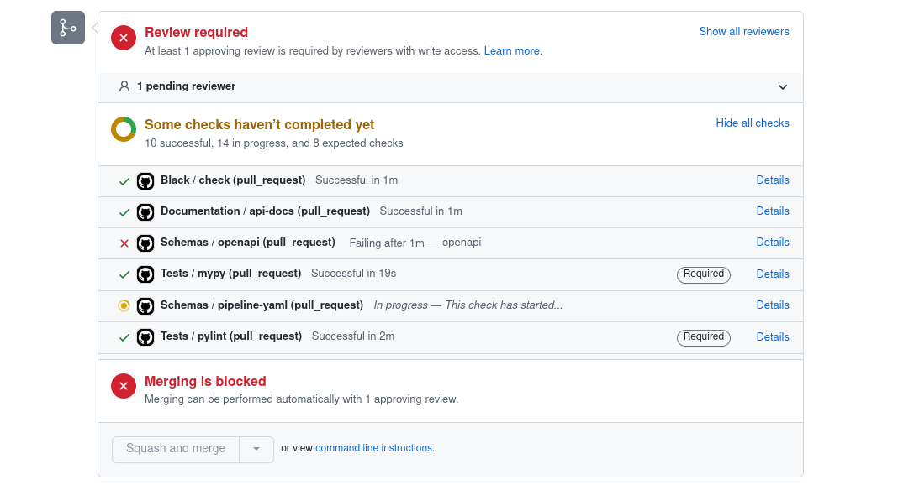
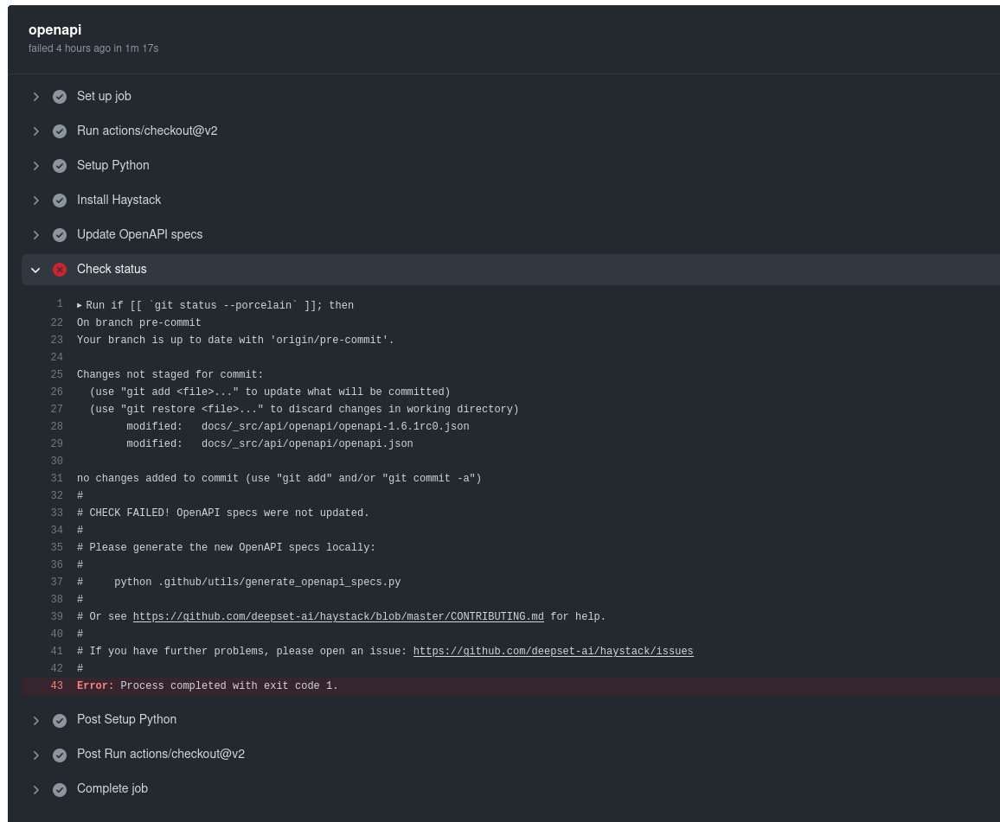
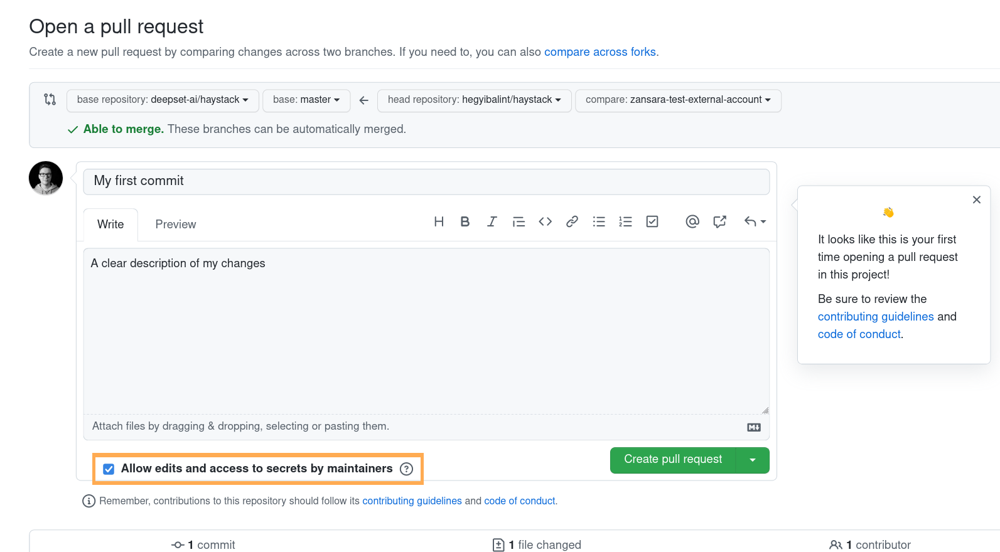

# Contributing to Haystack

First off, thanks for taking the time to contribute! :blue_heart:

All types of contributions are encouraged and valued. See the [Table of Contents](#table-of-contents)
for different ways to help and details about how this project handles them. Please make sure to read
the relevant section before making your contribution. It will make it a lot easier for us maintainers
and smooth out the experience for all involved. The community looks forward to your contributions!

> [!TIP]
> If you like Haystack but just don't have time to contribute, that's fine. There are other easy ways to support the
> project and show your appreciation, which we would also be very happy about:
> - Star this repository
> - Tweet about it
> - Mention Haystack at local meetups and tell your friends/colleagues

**Table of Contents**

- [Contributing to Haystack](#contributing-to-haystack)
  - [Code of Conduct](#code-of-conduct)
  - [I Have a Question](#i-have-a-question)
  - [Reporting Bugs](#reporting-bugs)
    - [Before Submitting a Bug Report](#before-submitting-a-bug-report)
    - [How Do I Submit a Good Bug Report?](#how-do-i-submit-a-good-bug-report)
  - [Suggesting Enhancements](#suggesting-enhancements)
    - [Before Submitting an Enhancement](#before-submitting-an-enhancement)
    - [How Do I Submit a Good Enhancement Suggestion?](#how-do-i-submit-a-good-enhancement-suggestion)
  - [Contribute code](#contribute-code)
    - [Where to start](#where-to-start)
    - [Setting up your development environment](#setting-up-your-development-environment)
    - [Clone the git repository](#clone-the-git-repository)
    - [Run the tests locally](#run-the-tests-locally)
  - [Requirements for Pull Requests](#requirements-for-pull-requests)
    - [Release notes](#release-notes)
  - [CI (Continuous Integration)](#ci-continuous-integration)
  - [Working from GitHub forks](#working-from-github-forks)
  - [Writing tests](#writing-tests)
    - [Unit test](#unit-test)
    - [Integration test](#integration-test)
    - [End to End (e2e) test](#end-to-end-e2e-test)
  - [Contributor Licence Agreement (CLA)](#contributor-licence-agreement-cla)

## Code of Conduct

This project and everyone participating in it is governed by our [Code of Conduct](code_of_conduct.txt).
By participating, you are expected to uphold this code. Please report unacceptable behavior to haystack@deepset.ai.

## I Have a Question

> [!TIP]
> If you want to ask a question, we assume that you have read the available [Documentation](https://docs.haystack.deepset.ai/docs/intro).

Before you ask a question, it is best to search for existing [Issues](/issues) that might help you. In case you have
found a suitable issue and still need clarification, you can write your question in this issue. It is also advisable to
search the internet for answers first.

If you then still feel the need to ask a question and need clarification, you can use one of our
[Community Channels](https://haystack.deepset.ai/community), Discord, in particular, is often very helpful.

## Reporting Bugs

### Before Submitting a Bug Report

A good bug report shouldn't leave others needing to chase you up for more information. Therefore, we ask you to
investigate carefully, collect information, and describe the issue in detail in your report. Please complete the
following steps in advance to help us fix any potential bug as fast as possible.

- Make sure that you are using the latest version.
- Determine if your bug is really a bug and not an error on your side, for example using incompatible versions.
  Make sure that you have read the [documentation](https://docs.haystack.deepset.ai/docs/intro). If you are looking
  for support, you might want to check [this section](#i-have-a-question).
- To see if other users have experienced (and potentially already solved) the same issue you are having, check if there
  is not already a bug report existing for your bug or error in the [bug tracker](/issues).
- Also make sure to search the internet (including Stack Overflow) to see if users outside of the GitHub community have
  discussed the issue.
- Collect information about the bug:
  - OS, Platform and Version (Windows, Linux, macOS, x86, ARM)
  - Version of Haystack and the integrations you're using
  - Possibly your input and the output
  - If you can reliably reproduce the issue, a snippet of code we can use

### How Do I Submit a Good Bug Report?

> [!IMPORTANT]
> You must never report security-related issues, vulnerabilities, or bugs, including sensitive information to the issue
> tracker, or elsewhere in public. Instead, sensitive bugs must be reported using [this link](https://github.com/deepset-ai/haystack/security/advisories/new).
>

We use GitHub issues to track bugs and errors. If you run into an issue with the project:

- Open an [Issue of type Bug Report](/issues/new?assignees=&labels=bug&projects=&template=bug_report.md&title=).
- Explain the behavior you would expect and the actual behavior.
- Please provide as much context as possible and describe the *reproduction steps* that someone else can follow to
  recreate the issue on their own. This usually includes your code. For good bug reports, you should isolate the problem
  and create a reduced test case.
- Provide the information you collected in the previous section.

Once it's filed:

- The project team will label the issue accordingly.
- A team member will try to reproduce the issue with your provided steps. If there are no reproduction steps or no
  obvious way to reproduce the issue, the team will ask you for those steps.
- If the team is able to reproduce the issue, the issue will scheduled for a fix or left to be
  [implemented by someone](#your-first-code-contribution).

## Suggesting Enhancements

This section guides you through submitting an enhancement suggestion, including new integrations and improvements
to existing ones. Following these guidelines will help maintainers and the community to understand your suggestion and
find related suggestions.

### Before Submitting an Enhancement

- Make sure that you are using the latest version.
- Read the [documentation](https://docs.haystack.deepset.ai/docs/intro) carefully and find out if the functionality
  is already covered, maybe by an individual configuration.
- Perform a [search](/issues) to see if the enhancement has already been suggested. If it has, add a comment to the
  existing issue instead of opening a new one.
- Find out whether your idea fits with the scope and aims of the project. It's up to you to make a strong case to
  convince the project's developers of the merits of this feature. Keep in mind that we want features that will be
  useful to the majority of our users and not just a small subset. If you're just targeting a minority of users,
  consider writing and distributing the integration on your own.

### How Do I Submit a Good Enhancement Suggestion?

Enhancement suggestions are tracked as GitHub issues of type [Feature request for existing integrations](/issues/new?assignees=&labels=feature+request&projects=&template=feature-request-for-existing-integrations.md&title=).

- Use a **clear and descriptive title** for the issue to identify the suggestion.
- Fill the issue following the template

## Contribute code

> [!IMPORTANT]
> When contributing to this project, you must agree that you have authored 100% of the content, that you have the
> necessary rights to the content and that the content you contribute may be provided under the project license.

### Where to start

If this is your first contribution, a good starting point is looking for an open issue that's marked with the label
["good first issue"](https://github.com/deepset-ai/haystack/issues?q=is%3Aopen+is%3Aissue+label%3A%22good+first+issue%22).
The core contributors periodically mark certain issues as good for first-time contributors. Those issues are usually
limited in scope, easily fixable and low priority, so there is absolutely no reason why you should not try fixing them,
it's a good excuse to start looking into the project and a safe space for experimenting failure: if you don't get the
grasp of something, pick another one! Once you become comfortable contributing to Haystack, you can have a look at the
list of issues marked as [contributions wanted](https://github.com/orgs/deepset-ai/projects/14/views/1) to look for your
next contribution!

### Setting up your development environment

Haystack makes heavy use of [Hatch](https://hatch.pypa.io/latest/), a Python project manager that we use to set up the
virtual environments, build the project, and publish packages. As you can imagine, the first step towards becoming a
Haystack contributor is installing Hatch. There are a variety of installation methods depending on your operating system
platform, version, and personal taste: please have a look at [this page](https://hatch.pypa.io/latest/install/#installation)
and keep reading once you can run from your terminal:

```console
$ hatch --version
Hatch, version 1.9.3
```

### Clone the git repository

You won't be able to make changes directly to this repo, so the first step is to [create a fork](https://docs.github.com/en/pull-requests/collaborating-with-pull-requests/working-with-forks/fork-a-repo).
Once your fork is ready, you can clone a local copy with:

```console
$ git clone https://github.com/YOUR-USERNAME/haystack
```

If everything worked, you should be able to do something like this (the output might be different):

```console
$ cd haystack
$ hatch version
2.3.0-rc0
```

Last, install the pre-commit hooks with:

```bash
pre-commit install
```

This utility will run some tasks right before all `git commit` operations. From now on, your `git commit` output for
Haystack should look something like this:

```
> git commit -m "test"
check python ast.........................................................Passed
check json...........................................(no files to check)Skipped
check for merge conflicts................................................Passed
check that scripts with shebangs are executable..........................Passed
check toml...........................................(no files to check)Skipped
check yaml...........................................(no files to check)Skipped
fix end of files.........................................................Passed
mixed line ending........................................................Passed
don't commit to branch...................................................Passed
trim trailing whitespace.................................................Passed
black-jupyter............................................................Passed
ruff.....................................................................Passed
codespell................................................................Passed
Lint GitHub Actions workflow files...................(no files to check)Skipped
[massi/contrib d18a2577] test
 2 files changed, 178 insertions(+), 45 deletions(-)
```

### Run the tests locally

Tests will automatically run in our CI for every commit you push to your PR on Github. In order to save precious CI time
we encourage you to run the tests locally before pushing new commits to Github. From the root of the git repository,
you can run all the unit tests like this:

```sh
hatch run test:unit
```

Hatch will create a dedicated virtual environment, sync the required dependencies and run all the unit tests from the
project. If you want to run a subset of the tests or even one test in particular, `hatch` will accept all the
options you would normally pass to `pytest`, for example:

```sh
# run one test method from a specific test class in a test file
hatch run test:unit test/test_logging.py::TestSkipLoggingConfiguration::test_skip_logging_configuration
```

We also use tools to ensure consistent code style, quality, and static type checking. The quality of your code will be
tested by the CI, but once again, running the checks locally will speed up the review cycle. To check your code you
can run:

```sh
hatch run test:lint
```

If the linters spot any error, you can fix it before checking in your code:

```sh
hatch run test:lint-fix
```

## Requirements for Pull Requests

To ease the review process, please follow the instructions in this paragraph when creating a Pull Request:

- For the title, use the [conventional commit convention](https://www.conventionalcommits.org/en/v1.0.0/).
- For the body, follow the existing [pull request template](https://github.com/deepset-ai/haystack/blob/main/.github/pull_request_template.md) to describe and document your changes.

### Release notes

Each PR must include a release notes file under the `releasenotes/notes` path created with `reno`, and a CI check will
fail if that's not the case. Pull requests with changes limited to tests, code comments or docstrings, and changes to
the CI/CD systems can be labeled with `ignore-for-release-notes` by a maintainer in order to bypass the CI check.

For example, if your PR is bumping the `transformers` version in the `pyproject.toml` file, that's something that
requires release notes. To create the corresponding file, from the root of the repo run:

```
$ hatch run release-note bump-transformers-to-4-31
```

A release notes file in YAML format will be created in the appropriate folder, appending a unique id to the name of the
release note you provided (in this case, `bump-transformers-to-4-31`). To add the actual content of the release notes,
you must edit the file that's just been created. In the file, you will find multiple sections along with an explanation
of what they're for. You have to remove all the sections that don't fit your release notes, in this case for example
you would fill in the `enhancements` section to describe the change:

```yaml
enhancements:
  - |
    Upgrade transformers to the latest version 4.31.0 so that Haystack can support the new LLama2 models.
```

You can now add the file to the same branch containing the code changes. Your release note will be part of your pull
request and reviewed along with any code you changed.

## CI (Continuous Integration)

We use GitHub Action for our Continuous Integration tasks. This means that as soon as you open a PR, GitHub will start
executing some workflows on your changes, like automated tests, linting, formatting, api docs generation, etc.

If all goes well, at the bottom of your PR page you should see something like this, where all checks are green.



If you see some red checks (like the following), then something didn't work, and action is needed from your side.



Click on the failing test and see if there are instructions at the end of the logs of the failed test.
For example, in the case above, the CI will give you instructions on how to fix the issue.



## Working from GitHub forks

In order for maintainers to be able to help you, we usually ask contributors to give us push access to their fork.

To do so, please verify that "Allow edits and access to secrets by maintainers" on the PR preview page is checked
(you can check it later on the PR's sidebar once it's created).



## Writing tests

We formally define three scopes for tests in Haystack with different requirements and purposes:

### Unit test
- Tests a single logical concept
- Execution time is a few milliseconds
- Any external resource is mocked
- Always returns the same result
- Can run in any order
- Runs at every commit in PRs, automated through `hatch run test:unit`
- Can run locally with no additional setup
- **Goal: being confident in merging code**

### Integration test
- Tests a single logical concept
- Execution time is a few seconds
- It uses external resources that must be available before execution
- When using models, cannot use inference
- Always returns the same result or an error
- Can run in any order
- Runs at every commit in PRs, automated through `hatch run test:integration`
- Can run locally with some additional setup (e.g. Docker)
- **Goal: being confident in merging code**

### End to End (e2e) test
- Tests a sequence of multiple logical concepts
- Execution time has no limits (can be always on)
- Can use inference
- Evaluates the results of the execution or the status of the system
- It uses external resources that must be available before execution
- Can return different results
- Can be dependent on the order
- Can be wrapped into any process execution
- Runs outside the development cycle (nightly or on demand)
- Might not be possible to run locally due to system and hardware requirements
- **Goal: being confident in releasing Haystack**

## Contributor Licence Agreement (CLA)

Significant contributions to Haystack require a Contributor License Agreement (CLA). If the contribution requires a CLA,
we will get in contact with you. CLAs are quite common among company-backed open-source frameworks, and our CLA’s wording
is similar to other popular projects, like [Rasa](https://cla-assistant.io/RasaHQ/rasa) or
[Google's Tensorflow](https://cla.developers.google.com/clas/new?domain=DOMAIN_GOOGLE&kind=KIND_INDIVIDUAL)
(retrieved 4th November 2021).

The agreement's main purpose is to protect the continued open use of Haystack. At the same time, it also helps in
\protecting you as a contributor. Contributions under this agreement will ensure that your code will continue to be
open to everyone in the future (“You hereby grant to Deepset **and anyone** [...]”) as well as remove liabilities on
your end (“you provide your Contributions on an AS IS basis, without warranties or conditions of any kind [...]”). You
can find the Contributor Licence Agreement [here](https://cla-assistant.io/deepset-ai/haystack).

If you have further questions about the licensing, feel free to reach out to contributors@deepset.ai.
