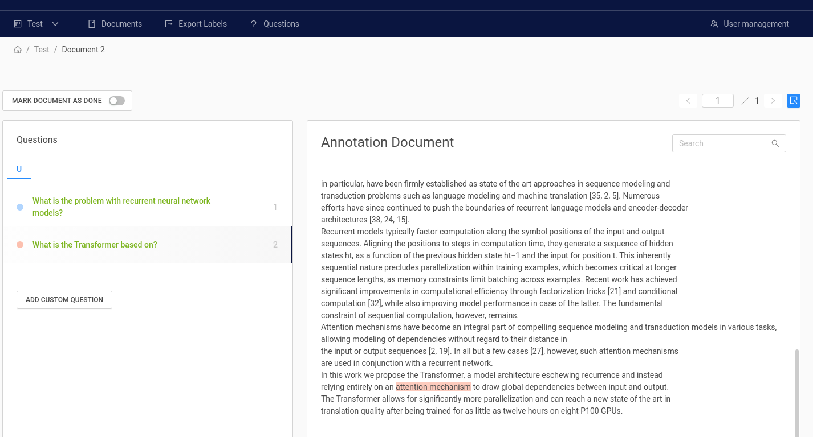

<!---
title: "Domain Adaptation"
metaTitle: "Domain Adaptation"
metaDescription: ""
slug: "/docs/domain_adaptation"
date: "2020-09-03"
id: "domain_adaptationmd"
--->

# Domain Adaptation

## Generalisation

In our experience, language models trained on SQuAD show very strong general question answering capabilities.
Though SQuAD is composed entirely of Wikipedia articles, these models are flexible enough to deal with many different styles of text.

Before trying to adapt these models to your domain, we’d recommend trying one of the off the shelf models.
We’ve found that these models are often flexible enough for a wide range of use cases.

**Intuition**: Most people probably don’t know what an HP Valve is.
But you don’t always need to know what a HP Valve is to answer “What is connected to a HP Valve?”
The answer might be there in plain language.
In the same way, many QA models have a good enough grasp of language to answer questions about concepts in an unseen domain.

## Finetuning

Any model that can be loaded into Haystack can also be finetuned within Haystack.
Simply provide the domain specific dataset and call `Reader.train()` on an initialised model.

```
reader.train(data_dir=train_data,
             train_filename="dev-v2.0.json",
             n_epochs=1,
             save_dir="my_model")
```

At the end of training, the finetuned model will be saved in the specified `save_dir` and can be loaded as a `Reader`.
See Tutorial 2 for a runnable example of this process.
If you’re interested in measuring how much your model has improved,
please also check out Tutorial 5 which walks through the steps needed to perform evaluation.

## Generating Labels

Using our [Haystack Annotate tool](https://annotate.deepset.ai/login) (Beta),
you can easily create a labelled dataset using your own documents featuring your own question/ answer pairs.




Features include:


* Structured workspaces via organisations, projects and users


* Easy upload of your own documents and labels in a variety of formats (txt, pdf, SQuAD style)


* Export of labels to be used directly in Haystack

Annotate also supports two different workflows:


* Think up questions and answers while reading passages (SQuAD style)


* Have a set of predefined questions and look for answers in the document (~ Natural Questions style)

## User Feedback

A simpler and faster process to finetune models to your domain is to utilise user feedback. 
Dedicated annotation work can be costly and time consuming 
but user feedback is an efficient alternative since it allows for labels to be generated by users, for users, 
all while the system is already in production.
We, for example, have used a simple thumbs up / down system in our demos to allow
users to give feedback.


Through the Rest API, users can annotate each Haystack result as being either:

* Correct
* Correct document but wrong text
* Wrong document and wrong text

To get started, follow these steps:

* Start up the REST API
    * The simplest way to do this is to call `docker-compose up` from the root directory of the Haystack repository
    * Alternatively, run `gunicorn rest_api.application:app -b 0.0.0.0:8000 -k uvicorn.workers.UvicornWorker -t 300`
* Make a POST request to the `doc-qa-feedback` endpoint with the following payload:
```
{
  "question": "string",
  "is_correct_answer": true,
  "document_id": "string",
  "model_id": 0,
  "is_correct_document": true,
  "answer": "string",
  "offset_start_in_doc": 0
}
```
To fill out all these values, you can use the response from an executed search request on the `doc-qa` endpoint.

* Export your labels in SQuAD format by making a GET request to the `export-doc-qa-feedback` endpoint
``` python
# SQUAD format
{
  "data": [
    {
      "title": "Normans",
      "paragraphs": [
        {
          "context": "The Normans (Norman: Nourmands; French: Normands; Latin: Normanni) were the...",
          "qas": [
            {
              "question": "In what country is Normandy located?",
              "id": "56ddde6b9a695914005b9628",
              "answers": [
                {
                  "text": "France",
                  "answer_start": 159
                }
              ]
            }
          ]
        }
      ]
    }
  ]
}
```

User feedback labelling also works with FAQ style QA. 
Refer to the Swagger API documentation (http://127.0.0.1:8000/docs) for more details.

This labelled data can then be used to 
augment the training data and enable `Reader` finetuning. 
Alternatively, they can also be used to form an evaluation set to 
measure the performance of trained models, 
or monitor how well the model is doing in a live environment.

